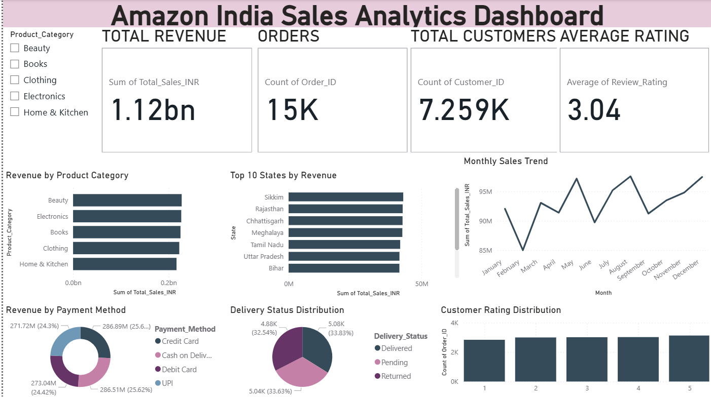

# Sales Analytics and Forecasting Dashboard Using Amazon India E-Commerce Data

## Overview

This project analyzes Amazon India e-commerce sales data to identify sales trends, customer behavior, product performance, and regional demand. The project includes exploratory data analysis (EDA), an interactive Power BI dashboard, and a sales forecasting model built using machine learning.

## Technologies Used

- Python
- Pandas
- Matplotlib
- Scikit-learn
- Power BI

## Key Features

- Data Cleaning and Preprocessing
- Exploratory Data Analysis (EDA)
- KPI Analysis
- Product Category Analysis
- State-wise Sales Analysis
- Payment Method Analysis
- Delivery Status Analysis
- Customer Rating Analysis
- Interactive Power BI Dashboard
- Sales Forecasting using Linear Regression

## Dashboard Metrics

- Total Revenue
- Total Orders
- Total Customers
- Average Rating
- Monthly Sales Trend
- Top States by Revenue
- Revenue by Product Category

## Model Evaluation

- MAE: 2,897,286.74
- RMSE: 3,638,055.73

## Project Status

✅ Completed

## Dashboard Preview

